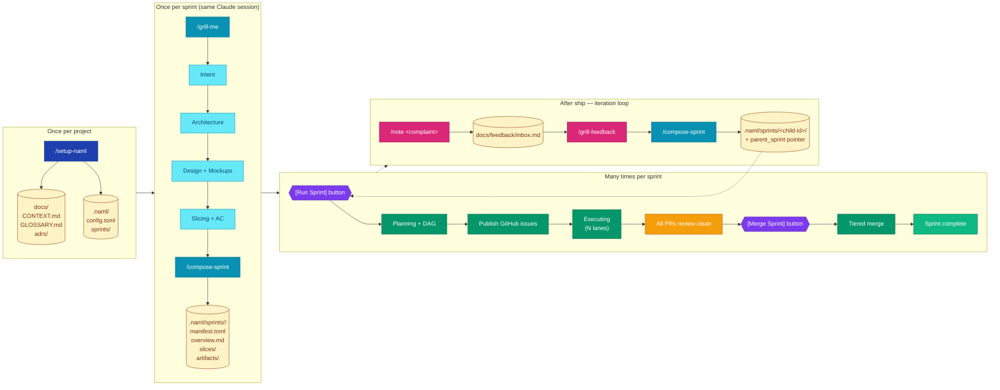
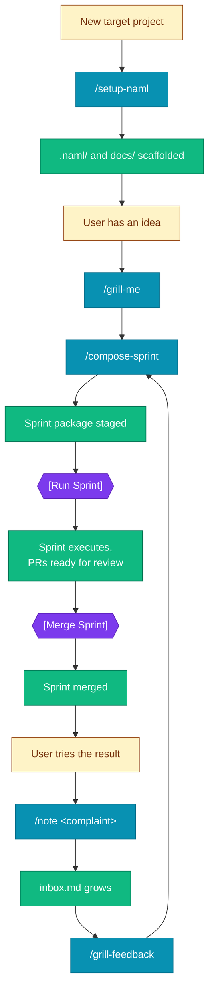
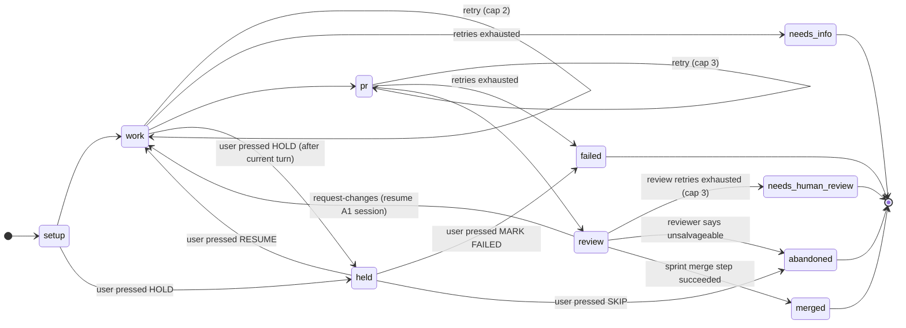
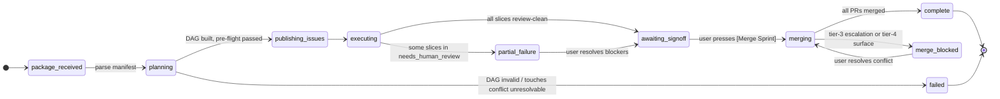
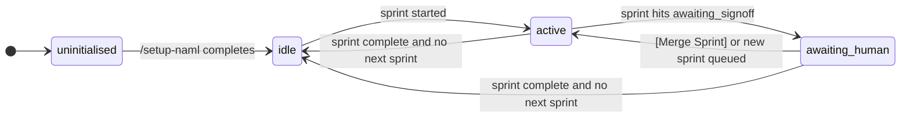
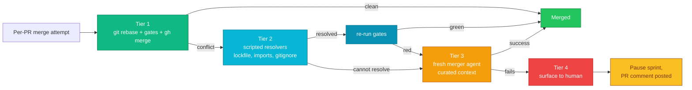

# Naml — Design V2

> Status: design captured 2026-05-18 from a grilling session.
> Supersedes the current `to-issues → batch-ready → make burst → make finish` flow.

This document captures the redesigned end-to-end pipeline for naml: how a user goes from an idea to merged code, what skills run in what order, the architectural conventions and vocabulary, and the state machines at every layer.

---

## 1. Why this redesign

The current flow stitches together five skills (`/grill → /prd → /to-issues → /triage → /batch-ready`) plus two operator commands (`make burst`, `make finish`). In practice, the user runs all five skills back-to-back without inspecting intermediates — the friction comes from the chain itself, not the work done in each step. This redesign collapses the chain into **three skills before the orchestrator and two buttons after**, with state machines at every level (slice, sprint, project) so the user can see the full pipeline at a glance.

Core shifts:

- **Sprint package** replaces the issue queue as the source of truth.
- **Each slice is independent by default**; parallelism is computed from a declared DAG.
- **Review is part of the main pipeline** (not a separate `make finish` step).
- **Merge is tiered** (deterministic → scripted → agent → human escalation).
- **Two buttons total**: `Run Sprint` and `Merge Sprint`. No more burst/slow/finish distinctions.
- **Feedback is a first-class sprint type** with a parent pointer and a curated context preload.

---

## 2. Vocabulary

| Term | Definition |
|---|---|
| **Project** | A target codebase that naml manages. One project = one git repository with `.naml/` and `docs/` directories. |
| **Sprint** | A bounded unit of work captured as a **sprint package**. Has an immutable lifecycle: planned → executed → merged. |
| **Sprint package** | The on-disk artifact (`.naml/sprints/<id>/`) that contains the manifest, overview, per-slice prompts, and artifacts. The orchestrator consumes this. |
| **Slice** | A vertical tracer-bullet unit of work cutting end-to-end through every layer (schema, API, UI, tests). Typed AFK or HITL. The smallest schedulable unit. |
| **DAG** | Directed Acyclic Graph of slices and their dependencies. Drives parallel scheduling and merge order. |
| **Lane** | A worker that processes slices. Each lane has its own git worktree and Claude Code session. Lanes operate in parallel up to `min(configured, dag_width, headroom)`. |
| **State** | Position of a slice/sprint/project in its state machine (`work`, `pr`, `review`, etc.). |
| **Grill** | The conversational design session that produces sprint content. Phase-routed: intent → architecture → design → slicing → AC. |
| **Compose** | Deterministic step that materializes a grill session into `.naml/sprints/<id>/`. Runs in the same Claude session as the grill. |
| **Feedback sprint** | A child sprint with a `parent_sprint` pointer in its manifest. Triggered by `/grill-feedback` against `docs/feedback/inbox.md`. |
| **ADR** | Architectural Decision Record. Lives at `docs/adrs/NNNN-<title>.md`. Read by grilling; written by grilling when sprints make new decisions. |

---

## 3. End-to-end pipeline



---

## 4. Skills inventory

| Skill | Cardinality | Inspired by | What it does |
|---|---|---|---|
| **`/setup-naml`** | Once per project | `setup-matt-pocock-skills` | Scaffolds `docs/` (CONTEXT.md, GLOSSARY.md, adrs/) and `.naml/` (config.toml, sprints/). Detects project shape (Python/TS/Go), proposes gate commands, confirms GitHub slug. Migrates `.agents-orchestrator.toml` if present. |
| **`/grill-me`** | Once per sprint | `grill-with-docs` + `grill-with-mockups` (consolidated) | Multi-phase conversational design session: intent → architecture → design → slicing → acceptance criteria. Internal routing chooses which phases run (skips design for backend-only sprints). |
| **`/compose-sprint`** | Once per sprint, **same Claude session** as grill-me | (new, naml-specific) | Deterministic structuring step. Reads grill content from conversation context, writes `.naml/sprints/<id>/{manifest.toml, overview.md, slices/*.md, artifacts/}`. Stages a git commit. |
| **`/note`** | Many times per sprint, ad-hoc | (new, naml-specific) | Thin capture skill. Appends a feedback bullet to `docs/feedback/inbox.md` with date + target sprint detection. |
| **`/grill-feedback`** | Once per feedback round | (new, derived from grill-me) | Short focused grilling against an existing parent sprint. Pre-loads curated context from parent. Output: 1-3 slices typically. |

### Skills lifecycle diagram



---

## 5. Sprint package format

The on-disk structure consumed by the orchestrator. Lives at `.naml/sprints/<sprint-id>/`.

```
.naml/sprints/2026-05-18-html-renderer/
  manifest.toml          ← orchestration metadata, machine-readable
  overview.md            ← sprint intent, injected into every slice prompt
  feedback.md            ← (only for feedback sprints) raw user notes
  slices/
    slice-1.md           ← per-slice spec, AC, slice-specific notes
    slice-2.md
    slice-3.md
  artifacts/
    mock-output.html
    sample-config.json
    eval-data/
  state/                 ← runtime-only, gitignored, orchestrator-written
    slice-1.summary.md   ← auto-generated handoff for downstream slices
    slice-1.status.json  ← in-progress/done/failed
    slice-1.review.md    ← auto-review verdict
    issues.json          ← slice_id → GitHub issue number mapping
    ...
```

### `manifest.toml` schema

```toml
[sprint]
id            = "2026-05-18-html-renderer"
title         = "Add HTML mock renderer with eval harness"
target_repo   = "owner/repo"
base_branch   = "main"

[meta]
parent_sprint = ""                  # set for feedback sprints
kind          = "greenfield"        # greenfield | feedback

[[slices]]
id         = "slice-1"
title      = "Render config schema"
type       = "AFK"                  # AFK | HITL
depends_on = []
touches    = ["src/render/config/**", "tests/render/config/**"]
prompt     = "slices/slice-1.md"
adrs       = ["docs/adrs/0007-template-engine.md"]   # optional

[[slices]]
id         = "slice-2"
title      = "HTML renderer"
type       = "AFK"
depends_on = ["slice-1"]
touches    = ["src/render/html/**", "tests/render/html/**"]
prompt     = "slices/slice-2.md"
```

### `slices/slice-N.md` shape

```markdown
# slice-2: HTML renderer

## What to build
[End-to-end behavior — what the slice delivers.]

## Acceptance criteria
- [ ] Criterion 1
- [ ] Criterion 2

## Artifacts (referenced, not embedded)
- ../artifacts/mock-output.html
- ../artifacts/sample-config.json

## Constraints
- [Slice-specific constraints]

## Notes from grilling session
[Slice-specific nuance worth preserving verbatim.]
```

The agent's effective prompt at runtime = `overview.md` + relevant `state/slice-*.summary.md` (upstream deps) + the slice's own `slice-N.md` + referenced artifacts + relevant ADRs.

---

## 6. State machines

### Per-slice (lane) state machine



- `work` is the implementation agent (A1, fresh session per slice).
- `review` spawns a **fresh** reviewer agent (A2) — never self-review.
- Review's `request-changes` **resumes A1's session** so the implementer has its own context for the fix.
- Retry caps are per-state, not per-slice.
- `held` is a **user-driven safe-intervention pause**. Triggered from the
  cockpit drawer's HOLD button (writes `state/<slice>.hold_requested`).
  The lane finishes its in-flight Claude turn, releases its worktree
  lock, and parks until the sentinel is removed by RESUME. While held,
  the open-in-terminal action is unlocked so the user can `cd` into the
  worktree without interrupting an active session. `pr` and downstream
  states are NOT held-able — the lane is already at rest there.
- **Cross-restart HOLD/RESUME edge case.** If the user presses RESUME via
  the cockpit while the orchestrator process is dead (sentinel cleared
  but no lane is running to notice), the next `naml run` will see
  `status.state == held`, no sentinel on disk, and the scheduler's
  `absorb_existing_statuses` defensively re-writes the sentinel — the
  user has to press RESUME again once the orchestrator is back. This is
  by design: naml can't honor an instruction it didn't see, and the
  state-on-disk is the trusted record. The cockpit should surface "naml
  is offline — interventions will queue when it restarts" so this
  doesn't look like a bug.

### Sprint state machine



### Project state machine



Project state aggregates across sprints; sprint state aggregates across slices.

---

## 7. Parallelism, DAG, lanes

### Lane count rule

```
actual_lanes = min(configured_lanes ?? 3,   # naml config default
                   dag_width,                # max parallel slices in current DAG
                   headroom_check)           # token/memory/disk gates
```

Default `parallel_lanes = 3`. User can override in `.naml/config.toml`. Hard cap recommended at 8 (resource limits beyond that). Lanes are work-stealing — they pull from a shared ready queue, not from pre-assigned partitions.

### Pre-flight overlap check

After grill-me declares `depends_on` and `touches` per slice, compose-sprint runs a deterministic check:

> Any two slices that declare independence but share a `touches` glob get forced into a serial edge (with a UI warning).

This is the safety net against forgotten dependencies. No LLM at runtime; pure glob comparison.

### Why not infinite lanes

| Constraint | Effect |
|---|---|
| Token budgets (Claude Code session + weekly caps) | 20 concurrent agents drain quota in minutes |
| API cost (linear in concurrency) | Off-rails slice burns budget until timeout |
| System resources (memory, file handles, disk) | Each lane = one worktree + one Claude process |
| Git serialization at `.git/objects/` | Worktree creation needs a lock; high concurrency starves |
| Merger context bloat | 30 summaries at merge time strains the merger session |
| Visual monitoring | Lane grid stops being scannable past ~6 lanes |
| DAG width is an upper bound | No point spawning lanes the DAG can't fill |

Lane count is a knob, not a ceiling. Work-stealing means 3 lanes still finish 12 parallelizable slices — just over multiple waves.

---

## 8. Tiered merge pipeline



**Tier 1 hit rate (expected): 70-80%.** Pure `git rebase origin/main` → re-run gates → `gh pr merge --squash`. No LLM involved.

**Tier 2 (~10-15%).** Scripted resolvers for known-mechanical files (lockfile regeneration, import-barrel merges, gitignore prefer-newer). Deterministic.

**Tier 3 (~5-10%).** Fresh merger session with curated context: all slice summaries, all reviews, the DAG, known gotchas. **One attempt only** — no infinite retry loop.

**Tier 4 (rare).** Sprint pauses; PR comment posted with diagnostics. Human resolves.

Dep chains use **stacked PRs**: dependent slices target their parent's branch, not main. Merger rebases each onto current main in topological order.

---

## 9. Feedback loop

```mermaid
flowchart LR
    A[Sprint X merged]:::done --> B[User runs the result]:::user
    B --> C["Mid-work, /note 'complaint'"]:::skill
    C --> D[("docs/feedback/inbox.md<br/>appended bullet")]:::docs
    D --> B
    B --> E["Friday: enough notes"]:::user
    E --> F["/grill-feedback"]:::skill
    F --> G[Load curated parent context]:::ctx
    G --> H[Short grill phases<br/>1-3 slices]:::phase
    H --> I["/compose-sprint"]:::skill
    I --> J[(".naml/sprints/&lt;child-id&gt;/<br/>parent_sprint = X<br/>kind = feedback")]:::docs
    I --> K[inbox archived]:::artifact
    J --> L{{"[Run Sprint]"}}:::button
    L --> M[Sprint executes]:::orch
    M --> N{{"[Merge Sprint]"}}:::button
    N --> O[Feedback sprint merged]:::done
    O -.-> B

    classDef done fill:#10b981,stroke:#047857,color:#fff
    classDef user fill:#fef3c7,stroke:#92400e,color:#78350f
    classDef skill fill:#0891b2,stroke:#0e7490,color:#fff
    classDef docs fill:#fde68a,stroke:#92400e,color:#78350f
    classDef artifact fill:#a7f3d0,stroke:#065f46,color:#064e3b
    classDef phase fill:#67e8f9,stroke:#0891b2,color:#0c4a6e
    classDef ctx fill:#c4b5fd,stroke:#6d28d9,color:#3b0764
    classDef button fill:#7c3aed,stroke:#5b21b6,color:#fff
    classDef orch fill:#059669,stroke:#047857,color:#fff
```



### `docs/feedback/` structure

```
docs/feedback/
  inbox.md             ← active, append-only, written by /note
  archive/
    2026-05-22-fb1.md  ← consumed inbox, archived when child sprint composes
    2026-05-24-fb2.md
```

`inbox.md` format:

```markdown
# Feedback inbox

## 2026-05-19 — target: html-renderer

- Slider doesn't snap to grid values
- API response is missing `created_at` field

## 2026-05-20 — target: html-renderer

- HTML output uses `<b>` instead of `<strong>` — accessibility issue
```

### Feedback-sprint differences from greenfield sprints

| Aspect | Greenfield sprint | Feedback sprint |
|---|---|---|
| Source | New idea | `docs/feedback/inbox.md` |
| Manifest | `kind = "greenfield"`, no parent | `kind = "feedback"`, `parent_sprint = "..."` |
| Grilling depth | Multi-phase (arch + design + ...) | Short, targeted, differential |
| Context pre-load | `docs/CONTEXT.md` + ADRs | Above + curated parent sprint outputs |
| Typical slice count | 3-8 | 1-3 |
| Same orchestrator, same buttons | ✅ | ✅ |

### Multi-bullet grouping rule

The feedback skill auto-groups bullets at classification time:

| Shape | Action |
|---|---|
| Same area of same parent | One sprint, 1-3 slices |
| Different unrelated areas of same parent | Split into multiple sprints |
| Different parent sprints | Always split |
| Mix of trivial + substantial | Split |

---

## 10. Issues — projection, not source of truth

GitHub issues persist, but their role changes:

- **Source of truth = sprint package on disk**, not GitHub issue state
- Issues are **auto-published from the manifest** at sprint kickoff (one issue per slice)
- PRs link to those issues (`Closes #N`); merging closes them automatically
- No `needs-triage` step — the package being committed *is* the readiness signal

### New label vocabulary

| Label | Meaning |
|---|---|
| `sprint:<id>` | All issues in this sprint |
| `slice:<id>` | This specific slice |
| `naml:running` | Lane is currently working on it |
| `naml:review` | PR open, in auto-review loop |
| `naml:human-review` | Auto-review retries exhausted |
| `naml:done` | Merged |

Old labels (`ready-for-agent`, `agent-running`, `agent-done`, `agent-failed`, `needs-info`, `needs-triage`) are retired.

---

## 11. Inspiration: Matt Pocock skills mapping

| Matt Pocock skill | Naml equivalent | What we kept | What we changed |
|---|---|---|---|
| `setup-matt-pocock-skills` | `/setup-naml` | Project-level scaffolding pattern, glossary discipline, ADR folder convention | Adds `.naml/` config + sprint dir; auto-generates a meta-ADR; detects gate commands |
| `to-issues` | Phases inside `/grill-me` + `/compose-sprint` | Vertical-slice tracer-bullet discipline; HITL/AFK classification; explicit dependencies; user-quizzing on granularity | Writes to local manifest instead of `gh issue create`; issues become a derived projection |
| `grill-with-docs` | Architecture phase of `/grill-me` | Conversational deep-dive on system design | Now one phase among several; produces ADR drafts when decisions land |
| `grill-with-mockups` | Design phase of `/grill-me` | Mockup-based visual grilling | Routed automatically when sprint is UI-shaped; skipped otherwise |
| Triage / labeling rituals | Removed | — | Source of truth lives in the package; triage was a queueing mechanism we no longer need |

The Matt Pocock pattern of `docs/` + `docs/adrs/` + GLOSSARY is preserved as a first-class convention. Grilling reads ADRs as constraints; grilling writes new ADRs as architectural decisions get made.

---

## 12. Architectural conventions (one-pagers)

### Sprint

- Immutable lineage: once a sprint merges, it's not amended; further changes happen in **child sprints**.
- Sprint IDs are date-prefixed kebab-case slugs: `2026-05-18-html-renderer`.
- A sprint owns: a manifest, an overview, a set of slices, optional artifacts, and runtime state.
- A sprint can be `greenfield` or `feedback`. Feedback sprints carry a `parent_sprint` pointer.

### Slice

- Vertical tracer bullet, end-to-end, demoable on its own.
- Typed `AFK` (agent finishes alone) or `HITL` (needs a human in the loop somewhere).
- Declares `depends_on` (slice IDs) and `touches` (path globs).
- Carries acceptance criteria; gates verify only those criteria.
- Receives upstream summaries auto-injected into its prompt.

### Grill

- Single Claude session, multi-phase, phase-routed by sprint shape.
- Reads `docs/CONTEXT.md`, `docs/GLOSSARY.md`, `docs/adrs/` for project context.
- Writes slice files incrementally as each slice converges (compaction-safe).
- Surfaces size hints: "consider splitting" past ~15 slices.

### Compose

- Runs in the **same Claude session** as the preceding grill (no handoff between sessions).
- Deterministic except for `touches:` glob inference (codebase-grounded LLM step).
- Stages a git commit; does not push.

### Feedback

- Authored via `/note` (append a bullet) — never by hand-editing inbox.md.
- Inbox is consumed and archived atomically when a feedback sprint composes.
- Feedback sprints are sprints — same orchestrator, same buttons, same state machines.

### ADR

- One markdown file per decision: `docs/adrs/NNNN-<title>.md`.
- Numbered sequentially. Grilling proposes new ADRs; user approves before they land.
- Sprint manifests can reference relevant ADRs in `[[slices]].adrs`; those ADRs are injected into the slice prompt.

### Lane

- One git worktree under `~/Library/Logs/agents-orchestrator/worktrees/`.
- One Claude Code session, fresh per slice. **Never shared across stacked-dependent slices.**
- Dependent slices receive upstream summaries via `state/<slice>.summary.md` injected into their prompt.
- Review-comment fix loop **does** resume the slice's own session.

### Tier (merge)

- Tier 1: pure git/gh, no LLM. Default and most common path.
- Tier 2: scripted resolvers for mechanical conflicts. No LLM.
- Tier 3: fresh merger agent. One attempt max.
- Tier 4: human escalation. Sprint pauses.

---

## 13. Migration notes (from current naml)

What changes from the existing implementation:

| Current | New |
|---|---|
| `to-issues` publishes GitHub issues | `to-issues` content moves inside `/grill-me`; outputs sprint package files |
| `batch-ready` skill clusters issues with labels | Removed. DAG declared in manifest; pre-flight overlap check enforces correctness |
| `triage` step gates work | Removed. Package commit IS the readiness signal |
| `make burst` (with stop_after) | `[Run Sprint]` button. Default end-to-end, optional stop-at-pr |
| `make finish` (resume sessions, address review) | Folded into the main pipeline as the `review` state of each slice |
| Per-lane state files `current.lane{N}.json` | Same mechanism; per-slice state machine now includes `review` properly |
| Labels: `ready-for-agent`, `agent-running`, etc. | Replaced with `sprint:<id>`, `slice:<id>`, `naml:running/review/done` |
| `.agents-orchestrator.toml` | Migrates to `.naml/config.toml` (strict rename) |
| Global `current.json` | Per-lane current state + per-sprint state + per-project state |

Behavior preserved unchanged:

- Worktree-per-lane execution model
- Work-stealing queue
- ETag-based UI polling
- Per-lane stage bar
- Claude Code allowedTools handling for headless commits

---

## 14. Open items deferred to UI grilling round

The following are designed at the architectural level but pending detailed UI specification (next session, using `/grill-with-mockups`):

- Dashboard hierarchy display (project → sprint → lane)
- Per-project Run Stats scoping (tokens + cost)
- Vertical lane layout, default 3 lanes
- Sprint lineage tree visualisation (root + feedback chain)
- Current sprint card vs next sprint preview
- State machine transitions and smoothness
- Filter cleanup (drop burst/slow/finish; map to new state vocabulary)
- Feedback inbox surfacing on dashboard

---

## 15. Summary cheat sheet

```
SKILLS (3 + 2):
  /setup-naml         once per project
  /grill-me           once per sprint
  /compose-sprint     once per sprint, same session as grill
  /note               many times, ad-hoc
  /grill-feedback     once per feedback round

BUTTONS (2):
  [Run Sprint]        kicks off orchestrator
  [Merge Sprint]      runs tiered merge

DIRECTORIES:
  docs/CONTEXT.md, docs/GLOSSARY.md, docs/adrs/   ← project-level docs
  docs/feedback/inbox.md, docs/feedback/archive/  ← feedback inbox
  .naml/config.toml                               ← naml config
  .naml/sprints/<id>/                             ← sprint packages

STATE MACHINES (3 layers):
  Project  → idle | active | awaiting_human
  Sprint   → planning | executing | awaiting_signoff | merging | complete
  Slice    → setup | work | pr | review | merged | held (+ failure terminals)

PARALLELISM:
  actual_lanes = min(configured ?? 3, dag_width, headroom)
  Work-stealing, fresh session per slice, stacked PRs for dep chains

MERGE:
  Tier 1 pure git → Tier 2 scripted → Tier 3 agent → Tier 4 human
```
